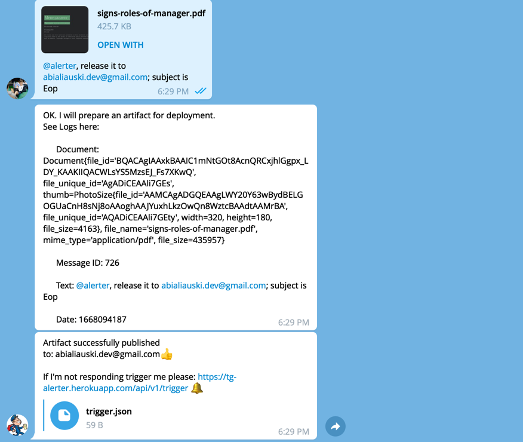

[Alerter](https://t.me/AlerterMailBot) is an Email assistant/[Telegram](https://telegram.org) chatbot. It helps you to deliver PDF documents faster. 

## What Problems Does Alerter Solve?

Automated PDF artifacts delivering. Alerter attempts to reduce an effort that you do to email and attach and PDF document.

## How It Works?

it does exactly this:

1. Reads the message you provide
2. Gets URL of PDF document via Telegram API
3. Forms an email
4. Sends it
5. Reports back to you.

# Want to contribute?
Don't be shy. Just open [issue](https://github.com/h1alexbel/alerter-mail/issues) or [pull request](https://github.com/h1alexbel/alerter-mail/pulls).